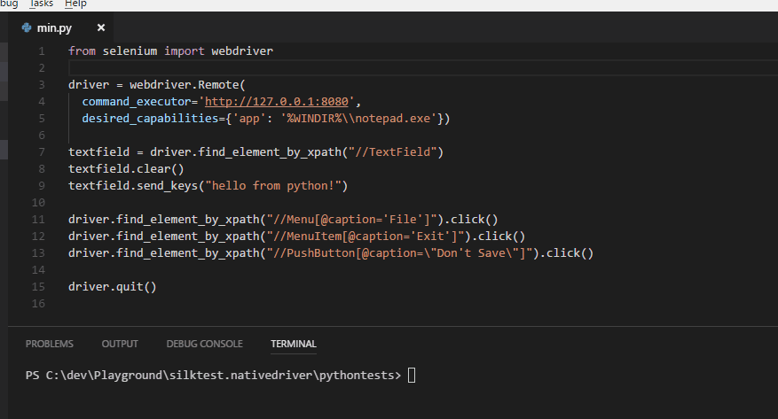
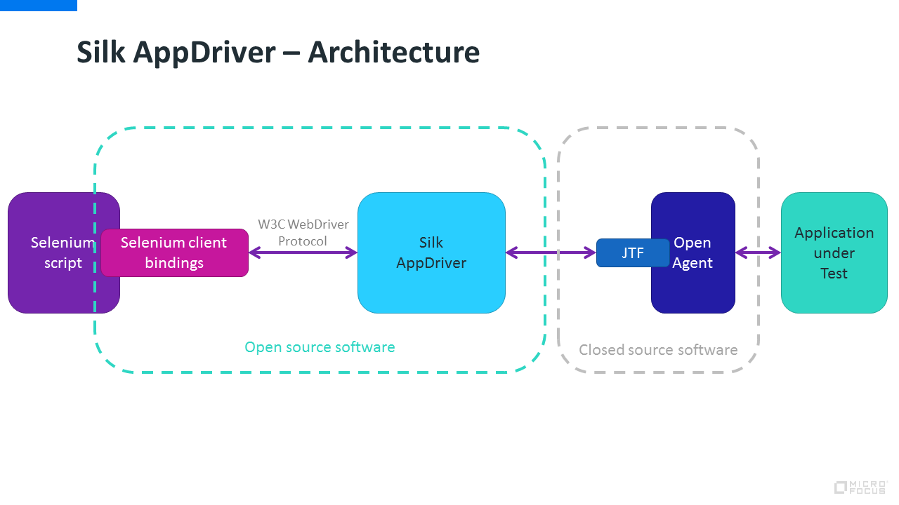

# Silk AppDriver #

**Silk AppDriver** is an implementation of the [W3C WebDriver protocol](https://www.w3.org/TR/webdriver/) for native (Windows) and mobile (Android and iOS) applications, built on top of [Silk Test](https://www.microfocus.com/de-de/products/silk-portfolio/silk-test/). The purpose of this project is to enable users of Silk Test to write tests for all kinds of applications using the WebDriver API in addition to the existing Silk Test APIs.

## Prerequisites ##

* Silk Test 18.0 has to be installed with a valid license. If you don't have Silk Test, download the evaluation version from [https://www.microfocus.com/de-de/products/silk-portfolio/silk-test/trial/](https://www.microfocus.com/de-de/products/silk-portfolio/silk-test/trial/)
* Java (at least 1.8) has to be installed

## Running ##

* Download the latest **Silk AppDriver** release from [GitHub](https://github.com/MicroFocus/SilkAppDriver/releases)
* Run the **Silk AppDriver** server from the command line: `java -jar silk-appdriver.jar`
* Run your tests against a *RemoteWebDriver* pointed to that server (http://localhost:8080 by default)
 * To use a different port than 8080 run **Silk AppDriver** with the `server.port` system property, for example `java -Dserver.port=8123 -jar silk-appdriver.jar`

## Examples ##

Here's a minimal example written in Python that automates notepad.exe using Silk AppDriver:

```python
from selenium import webdriver

driver = webdriver.Remote(
  command_executor='http://127.0.0.1:8080',
  desired_capabilities={'app': '%WINDIR%\\notepad.exe'})

textfield = driver.find_element_by_xpath("//TextField")
textfield.clear()
textfield.send_keys("hello from python!")

driver.find_element_by_xpath("//Menu[@caption='File']").click()
driver.find_element_by_xpath("//MenuItem[@caption='Exit']").click()
driver.find_element_by_xpath("//PushButton[@caption=\"Don't Save\"]").click()

driver.quit()
```



Further examples can be found here:
 * Java (notepad.exe): [NotepadDemoTest.java](samples/java/appdriver-tests/src/test/java/com/microfocus/silk/appdriver/tests/NotepadDemoTest.java)
 * Java (mobile app on Android): [MobileTests.java](samples/java/appdriver-tests/src/test/java/com/microfocus/silk/appdriver/tests/MobileTests.java)
 * Python (notepad.exe): [notepad.py](samples/python/notepad.py)
 * JavaScript (notepad.exe): [notepad.js](samples/javascript/notepad.js)

## Building ##

To build **Silk AppDriver** on the command line:
* Make sure you have silktest.jtf:18.0 in your local maven repository (See "Adding the JTF to your local Maven repository" in our ["Embracing Open Source"](https://community.microfocus.com/borland/test/silk_test/b/weblog/posts/embracing-open-source-maven-and-jenkins-2) blog post.)
* Build the project with maven (`mvn clean install`)
* Run the **Silk AppDriver** server from the command line: `java -jar target/silk-appdriver.jar`

To build Silk WebDriver in the IDE:
* Import the **Silk AppDriver** project into Eclipse (at least 4.6.0) and build with maven.

## Architecture ##



## Noteworthy ##
The controller stub was auto-generated based on the ["List of Endpoints"](https://www.w3.org/TR/webdriver/#list-of-endpoints) in the WebDriver standard using a simple Silk4J script. That can be found here: [appdriver-generate](src/silk.appdriver.generate/src/Generate.java)

## Current status ##

**Silk AppDriver** is still in an early stage and needs your help and contributions to get better!

### Locator strategies ###

Only *xpath* is currently supported as a locator strategy. Ony "Silk Test xpath" locators will work.

### API ###

The following table lists all methods listed in the [W3C spec](https://www.w3.org/TR/webdriver/) and the current status of the implementation in **Silk AppDriver**.

| Command  |  Status | Comment |
|----------|---------|---------|
| [New Session](https://www.w3.org/TR/webdriver/#dfn-new-session) | Done |  |
| [Delete Session](https://www.w3.org/TR/webdriver/#dfn-delete-session) | Done |  |
| [Status](https://www.w3.org/TR/webdriver/#dfn-status) | Done |  |
| [Get Timeouts](https://www.w3.org/TR/webdriver/#dfn-get-timeouts) | TODO |  |
| [Set Timeouts](https://www.w3.org/TR/webdriver/#dfn-set-timeouts) | TODO |  |
| [Go](https://www.w3.org/TR/webdriver/#dfn-go) | Done | Not supported (yields "unknown command") |
| [Get Current URL](https://www.w3.org/TR/webdriver/#dfn-get-current-url) | Done | Not supported (yields "unknown command") |
| [Back](https://www.w3.org/TR/webdriver/#dfn-back) | Done | Not supported (yields "unknown command") |
| [Forward](https://www.w3.org/TR/webdriver/#dfn-forward) | Done | Not supported (yields "unknown command") |
| [Refresh](https://www.w3.org/TR/webdriver/#dfn-refresh) | Done | Not supported (yields "unknown command") |
| [Get Title](https://www.w3.org/TR/webdriver/#dfn-get-title) | Done |  |
| [Get Window Handle](https://www.w3.org/TR/webdriver/#dfn-get-window-handle) | Done |  |
| [Close Window](https://www.w3.org/TR/webdriver/#dfn-close-window) | Done |  |
| [Switch To Window](https://www.w3.org/TR/webdriver/#dfn-switch-to-window) | TODO |  |
| [Get Window Handles](https://www.w3.org/TR/webdriver/#dfn-get-window-handles) | Done |  |
| [Switch To Frame](https://www.w3.org/TR/webdriver/#dfn-switch-to-frame) | Done | Not supported (yields "unknown command") |
| [Switch To Parent Frame](https://www.w3.org/TR/webdriver/#dfn-switch-to-parent-frame) | Done | Not supported (yields "unknown command") |
| [Get Window Rect](https://www.w3.org/TR/webdriver/#dfn-get-window-rect) | Done | |
| [Set Window Rect](https://www.w3.org/TR/webdriver/#dfn-set-window-rect) | Done | |
| [Maximize Window](https://www.w3.org/TR/webdriver/#dfn-maximize-window) | Done | |
| [Minimize Window](https://www.w3.org/TR/webdriver/#dfn-minimize-window) | Done |  |
| [Fullscreen Window](https://www.w3.org/TR/webdriver/#dfn-fullscreen-window) | Done |  |
| [Get Active Element](https://www.w3.org/TR/webdriver/#dfn-get-active-element) | TODO |  |
| [Find Element](https://www.w3.org/TR/webdriver/#dfn-find-element) | Done |  |
| [Find Elements](https://www.w3.org/TR/webdriver/#dfn-find-elements) | Done |  |
| [Find Element From Element](https://www.w3.org/TR/webdriver/#dfn-find-element-from-element) | Done |  |
| [Find Elements From Element](https://www.w3.org/TR/webdriver/#dfn-find-elements-from-element) | Done |  |
| [Is Element Selected](https://www.w3.org/TR/webdriver/#dfn-is-element-selected) | TODO |  |
| [Get Element Attribute](https://www.w3.org/TR/webdriver/#dfn-get-element-attribute) | TODO |  |
| [Get Element Property](https://www.w3.org/TR/webdriver/#dfn-get-element-property) | Done |  |
| [Get Element CSS Value](https://www.w3.org/TR/webdriver/#dfn-get-element-css-value) | Done | Not supported (yields "unknown command") |
| [Get Element Text](https://www.w3.org/TR/webdriver/#dfn-get-element-text) | Done |  |
| [Get Element Tag Name](https://www.w3.org/TR/webdriver/#dfn-get-element-tag-name) | Done | Yields the class name  |
| [Get Element Rect](https://www.w3.org/TR/webdriver/#dfn-get-element-rect) | Done |  |
| [Is Element Enabled](https://www.w3.org/TR/webdriver/#dfn-is-element-enabled) | TODO |  |
| [Element Click](https://www.w3.org/TR/webdriver/#dfn-element-click) | Done |  |
| [Element Clear](https://www.w3.org/TR/webdriver/#dfn-element-clear) | Done |  |
| [Element Send Keys](https://www.w3.org/TR/webdriver/#dfn-element-send-keys) | Partly done | Missing: Handling of special keys  |
| [Get Page Source](https://www.w3.org/TR/webdriver/#dfn-get-page-source) | Done | Not supported (yields "unknown command") |
| [Execute Script](https://www.w3.org/TR/webdriver/#dfn-execute-script) | Done | Not supported (yields "unknown command") |
| [Execute Async Script](https://www.w3.org/TR/webdriver/#dfn-execute-async-script) | Done | Not supported (yields "unknown command") |
| [Get All Cookies](https://www.w3.org/TR/webdriver/#dfn-get-all-cookies) | Done | Not supported (yields "unknown command") |
| [Get Named Cookie](https://www.w3.org/TR/webdriver/#dfn-get-named-cookie) | Done | Not supported (yields "unknown command") |
| [Add Cookie](https://www.w3.org/TR/webdriver/#dfn-add-cookie) | Done | Not supported (yields "unknown command") |
| [Delete Cookie](https://www.w3.org/TR/webdriver/#dfn-delete-cookie) | Done | Not supported (yields "unknown command") |
| [Delete All Cookies](https://www.w3.org/TR/webdriver/#dfn-delete-all-cookies) | Done | Not supported (yields "unknown command") |
| [Perform Actions](https://www.w3.org/TR/webdriver/#dfn-perform-implementation-specific-action-dispatch-steps) | TODO |  |
| [Release Actions](https://www.w3.org/TR/webdriver/#dfn-release-actions) | TODO |  |
| [Dismiss Alert](https://www.w3.org/TR/webdriver/#dfn-dismiss-alert) | TODO |  |
| [Accept Alert](https://www.w3.org/TR/webdriver/#dfn-accept-alert) | TODO |  |
| [Get Alert Text](https://www.w3.org/TR/webdriver/#dfn-get-alert-text) | TODO |  |
| [Send Alert Text](https://www.w3.org/TR/webdriver/#dfn-send-alert-text) | TODO |  |
| [Take Screenshot](https://www.w3.org/TR/webdriver/#dfn-take-screenshot) | TODO |  |
| [Take Element Screenshot](https://www.w3.org/TR/webdriver/#dfn-take-element-screenshot) | TODO |  |

### TODOs ###

The biggest TODOs currently are:

* Add more tests!
* Add tests in other Selenium languages!
* Implement the ability to specify more of the Silk Test BaseState options (through capabilities?)
* Implement attribute/property retrieval. Do we need to distinguish between the two?
* Implement handling special keys in `sendKeys` (map to Silk Test keys!)
* Implement screenshot API
* Implement customizable timeouts and other options
* Implement window handling and switching between multiple windows
* Add a possibility to get TrueLog files. Maybe we can use `executeScript` with a custom command to start/stop TrueLog?
* Implement other locator strategies (by Id, by className, ... should be easy to map to XPath)
* Implement alert handling
* Implement action API
* Add support for mobile and web apps
* The Java client bindings (among others) support a [Select](https://seleniumhq.github.io/selenium/docs/api/java/org/openqa/selenium/support/ui/Select.html) helper method. Internally this relies on a couple of specifics (tag name has to be "select", children have to be "options", ...). Can we make that work with our combo boxes as well?

## License
Code provided in this repository is licensed under the [Apache 2.0](LICENSE).

## Contribution
You want to contribute to **Silk AppDriver**? Great!

Changes may be contributed after signing the [Micro Focus Individual Contributor License Agreement 1.0](OpenSourceContributionAgreement1_0.pdf).
Signed contributor agreements are to be sent, via PDF, to <licensing@microfocus.com>.
You will be notified via email when the agreement has been accepted by Micro Focus.  
